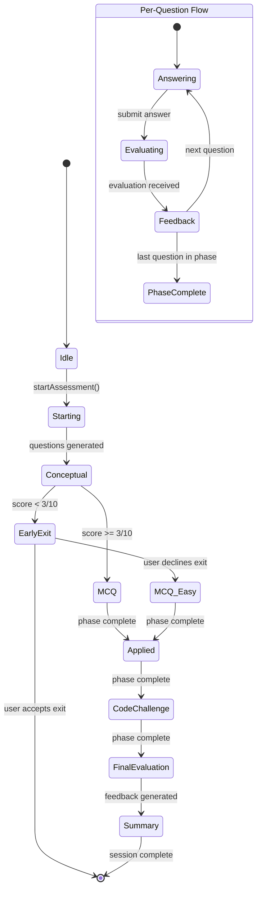

# Design Document: Adaptive Self-Test

## Overview

The Adaptive Self-Test system transforms the existing simple 3-question self-test (currently powered by `useSelfTestButton` hook + modal UI) into a comprehensive, multi-phase adaptive assessment engine. The new system introduces:

- **Multi-phase assessment structure**: Conceptual → MCQ → Applied → Code Challenge, with 2-3 questions per phase
- **Adaptive difficulty**: Real-time difficulty calibration based on per-phase performance
- **Workspace persistence**: Assessment records stored in `assessment-history.json` alongside topic folders
- **Session recovery**: In-progress sessions checkpointed to filesystem, recoverable on page refresh
- **Detailed feedback**: Per-question evaluation, per-phase scoring, and AI-generated feedback reports
- **Content improvement loop**: AI-assisted updates to topic artifacts based on assessment gaps
- **Assessment history**: Full history with trend indicators, detail previews, and targeted regeneration

The system replaces the existing `SelfTestButton` component and its `useSelfTestButton` hook with a dedicated assessment module under `app/self-test/`, following the self-contained module pattern established by `app/coding-interview/`.

### Key Design Decisions

1. **Self-contained module** (like `coding-interview/`): Own store, components, hooks, lib, and API routes — no shared state leaking.
2. **Zustand for runtime, filesystem for persistence**: Session_Store manages UI state in memory; checkpoints flow through server actions to `assessment-history.json`.
3. **One AI call per phase**: Keeps prompts focused and responses reliable (vs. one massive call for all questions).
4. **Local MCQ evaluation**: MCQ answers are evaluated client-side using the known correct answer — no AI round-trip needed.
5. **Weighted confidence formula**: Applied/Code Challenge phases weighted 30% each (vs 20% for Conceptual/MCQ) because they better validate real understanding.

---

## Architecture

### High-Level System Diagram

```mermaid
graph TB
    subgraph Client ["Client (Browser)"]
        UI[Assessment UI Components]
        Store[Session Store - Zustand]
        UI --> Store
    end

    subgraph ServerActions ["Server Actions"]
        SA_Start[startAssessment]
        SA_Checkpoint[checkpointPhase]
        SA_Complete[completeAssessment]
        SA_Delete[deleteRecord]
        SA_Resume[loadCheckpoint]
        SA_ContentUpdate[updateContent]
    end

    subgraph APIRoutes ["API Routes"]
        AI_Generate[/api/ai/assessment/generate]
        AI_Evaluate[/api/ai/assessment/evaluate]
        AI_Feedback[/api/ai/assessment/feedback]
        AI_Content[/api/ai/assessment/content-update]
    end

    subgraph Services ["Services Layer"]
        TopicSvc[TopicService]
        RevisionSvc[RevisionService]
        GitSvc[GitService]
        AssessmentRepo[AssessmentRepository]
    end

    subgraph Storage ["Workspace Filesystem"]
        HistoryFile["notes/{cat}/{slug}/assessment-history.json"]
        TopicFiles["notes/{cat}/{slug}/*.md"]
        RevisionFile["revision/revision.json"]
        PromptConfig[".config/prompt-config.json"]
    end

    Store --> SA_Start
    Store --> SA_Checkpoint
    Store --> SA_Complete
    Store --> SA_Delete
    Store --> SA_Resume

    UI --> AI_Generate
    UI --> AI_Evaluate
    UI --> AI_Feedback
    UI --> AI_Content

    SA_Start --> AssessmentRepo
    SA_Checkpoint --> AssessmentRepo
    SA_Complete --> AssessmentRepo
    SA_Complete --> RevisionSvc
    SA_Complete --> GitSvc
    SA_Delete --> AssessmentRepo
    SA_Delete --> GitSvc
    SA_Resume --> AssessmentRepo
    SA_ContentUpdate --> TopicSvc
    SA_ContentUpdate --> GitSvc

    AI_Generate --> PromptConfig
    AI_Generate --> TopicFiles

    AssessmentRepo --> HistoryFile
    TopicSvc --> TopicFiles
    RevisionSvc --> RevisionFile
```

### Session Flow Diagram



---

## Components and Interfaces

### Module Structure

```
app/self-test/
├── page.tsx                          # Entry route (receives topicId via searchParams)
├── SelfTestModule.tsx                # Root client component
├── components/
│   ├── assessment-launcher/          # Start/resume assessment UI
│   ├── phase-header/                 # Phase indicator + progress
│   ├── question-card/                # Renders question by type
│   ├── mcq-options/                  # MCQ answer selection
│   ├── code-editor/                  # Code challenge editor
│   ├── text-answer/                  # Open-ended answer textarea
│   ├── evaluation-card/              # Per-question feedback display
│   ├── phase-summary/                # Per-phase score summary
│   ├── early-exit-prompt/            # Early exit offer
│   ├── feedback-report/              # Final feedback report
│   ├── content-update-preview/       # Diff preview for content updates
│   ├── history-list/                 # Assessment history list
│   ├── history-detail/               # Detailed record preview
│   └── trend-indicator/              # Improving/stable/declining badge
├── hooks/
│   ├── useAssessmentSession.ts       # Main session orchestration hook
│   ├── useQuestionGeneration.ts      # AI question generation
│   ├── useAnswerEvaluation.ts        # AI evaluation + local MCQ check
│   ├── useFeedbackReport.ts          # Final report generation
│   ├── useContentUpdate.ts           # AI content update flow
│   └── useAssessmentHistory.ts       # History CRUD operations
├── store/
│   └── assessmentStore.ts            # Zustand session store
├── lib/
│   ├── types.ts                      # All assessment types
│   ├── schemas.ts                    # Zod schemas for AI responses
│   ├── constants.ts                  # Phase config, weights, thresholds
│   ├── scoring.ts                    # Score computation (pure functions)
│   ├── difficulty.ts                 # Difficulty calibration (pure functions)
│   └── validation.ts                 # Input validation utilities
├── actions/
│   ├── assessment-actions.ts         # Server actions for persistence
│   └── content-actions.ts            # Server actions for content updates
└── __tests__/
    ├── scoring.test.ts               # Unit + property tests for scoring
    ├── difficulty.test.ts            # Unit + property tests for difficulty
    ├── validation.test.ts            # Schema validation tests
    └── schemas.test.ts               # AI response schema tests
```

### New API Routes

```
app/api/ai/assessment/
├── generate/route.ts                 # POST: Generate questions for a phase
├── evaluate/route.ts                 # POST: Evaluate a single answer
├── feedback/route.ts                 # POST: Generate feedback report
└── content-update/route.ts           # POST: Generate content improvement
```

### New Repository

```
src/filesystem/FileAssessmentRepository.ts   # File-based assessment persistence
src/repository/AssessmentRepository.ts       # Interface definition
```

### Key Component Interfaces

```typescript
// SelfTestModule.tsx - Root component
interface SelfTestModuleProps {
  topicId: string;
  topic: Topic;
  artifacts: Record<string, string>;
}

// assessment-launcher
interface AssessmentLauncherProps {
  topicStatus: Topic["status"];
  hasInProgressSession: boolean;
  onStart: () => void;
  onResume: () => void;
  onDiscard: () => void;
}

// question-card
interface QuestionCardProps {
  question: AssessmentQuestion;
  phaseType: AssessmentPhaseType;
  onSubmit: (answer: string) => void;
  isEvaluating: boolean;
}

// evaluation-card
interface EvaluationCardProps {
  evaluation: QuestionEvaluation;
  question: AssessmentQuestion;
  userAnswer: string;
  onNext: () => void;
  isLastInPhase: boolean;
}

// feedback-report
interface FeedbackReportProps {
  report: FeedbackReport;
  confidenceScore: number;
  canComplete: boolean;
  onMarkCompleted: () => void;
  onUpdateContent: (artifact: string, gap: string) => void;
  onClose: () => void;
}

// history-list
interface HistoryListProps {
  records: AssessmentRecord[];
  trend: "improving" | "declining" | "stable" | null;
  onSelect: (recordId: string) => void;
  onDelete: (recordId: string) => void;
  onRegenerate: (recordId: string) => void;
}
```

---

## Data Models

### Core Zod Schemas (lib/types.ts + lib/schemas.ts)

```typescript
import { z } from "zod";

// ─── Enums & Literals ───────────────────────────────────────

export const AssessmentPhaseTypeSchema = z.enum([
  "conceptual",
  "mcq",
  "applied",
  "code-challenge",
]);
export type AssessmentPhaseType = z.infer<typeof AssessmentPhaseTypeSchema>;

export const DifficultyLevelSchema = z.enum(["easy", "medium", "hard"]);
export type DifficultyLevel = z.infer<typeof DifficultyLevelSchema>;

export const AssessmentStatusSchema = z.enum(["in-progress", "completed"]);
export type AssessmentStatus = z.infer<typeof AssessmentStatusSchema>;

export const TrendIndicatorSchema = z.enum(["improving", "declining", "stable"]);
export type TrendIndicator = z.infer<typeof TrendIndicatorSchema>;

// ─── Question Types ─────────────────────────────────────────

export const ConceptualQuestionSchema = z.object({
  type: z.literal("conceptual"),
  question: z.string(),
  expectedAnswer: z.string(),
});

export const MCQQuestionSchema = z.object({
  type: z.literal("mcq"),
  question: z.string(),
  options: z.array(z.string()).length(4),
  correctIndex: z.number().int().min(0).max(3),
  explanation: z.string(),
  distractorExplanations: z.array(z.string()).length(3),
});

export const AppliedQuestionSchema = z.object({
  type: z.literal("applied"),
  question: z.string(),
  scenario: z.string(),
  expectedAnswer: z.string(),
});

export const CodeChallengeQuestionSchema = z.object({
  type: z.literal("code-challenge"),
  question: z.string(),
  problemStatement: z.string(),
  inputFormat: z.string(),
  outputFormat: z.string(),
  examples: z.array(z.object({
    input: z.string(),
    expectedOutput: z.string(),
    explanation: z.string(),
  })).min(1).max(3),
});

export const AssessmentQuestionSchema = z.discriminatedUnion("type", [
  ConceptualQuestionSchema,
  MCQQuestionSchema,
  AppliedQuestionSchema,
  CodeChallengeQuestionSchema,
]);
export type AssessmentQuestion = z.infer<typeof AssessmentQuestionSchema>;

// ─── Evaluation ─────────────────────────────────────────────

export const QuestionEvaluationSchema = z.object({
  score: z.number().int().min(0).max(10),
  feedback: z.string().max(500),
  mistakes: z.array(z.string()).max(5),
  keyInsights: z.array(z.string()).max(3),
  expectedAnswer: z.string().optional(),
});
export type QuestionEvaluation = z.infer<typeof QuestionEvaluationSchema>;

// ─── Phase Result ───────────────────────────────────────────

export const PhaseResultSchema = z.object({
  phaseType: AssessmentPhaseTypeSchema,
  questions: z.array(AssessmentQuestionSchema),
  userAnswers: z.array(z.string()),
  evaluations: z.array(QuestionEvaluationSchema),
  phaseScore: z.number().min(0).max(10),
  difficulty: DifficultyLevelSchema,
});
export type PhaseResult = z.infer<typeof PhaseResultSchema>;

// ─── Feedback Report ────────────────────────────────────────

export const FeedbackReportSchema = z.object({
  overallConfidence: z.number().min(1).max(5),
  phaseScores: z.object({
    conceptual: z.number().min(0).max(10),
    mcq: z.number().min(0).max(10),
    applied: z.number().min(0).max(10),
    "code-challenge": z.number().min(0).max(10),
  }),
  strengths: z.array(z.string()).min(1).max(5),
  weaknesses: z.array(z.string()).min(1).max(5),
  studyRecommendations: z.array(z.object({
    recommendation: z.string(),
    targetSection: z.string(),
  })).min(2).max(5),
  suggestedContentUpdates: z.array(z.object({
    artifact: z.string(),
    gap: z.string(),
    suggestion: z.string(),
  })),
});
export type FeedbackReport = z.infer<typeof FeedbackReportSchema>;

// ─── Assessment Record (persisted) ─────────────────────────

export const AssessmentRecordSchema = z.object({
  id: z.string().uuid(),
  topicId: z.string(),
  status: AssessmentStatusSchema,
  startedAt: z.string().datetime(),
  completedAt: z.string().datetime().optional(),
  experienceLevel: z.union([z.literal(5), z.literal(10), z.literal(15)]),
  phases: z.array(PhaseResultSchema),
  feedbackReport: FeedbackReportSchema.optional(),
  confidenceScore: z.number().min(1).max(5).optional(),
  initialDifficulty: DifficultyLevelSchema,
});
export type AssessmentRecord = z.infer<typeof AssessmentRecordSchema>;

// ─── Assessment History File (assessment-history.json) ──────

export const AssessmentHistorySchema = z.object({
  topicId: z.string(),
  assessments: z.array(AssessmentRecordSchema).max(50),
});
export type AssessmentHistory = z.infer<typeof AssessmentHistorySchema>;
```

### Session Store Shape (Zustand — runtime only)

```typescript
export interface AssessmentSessionState {
  // Session identity
  sessionId: string | null;
  topicId: string | null;
  status: "idle" | "starting" | "in-phase" | "evaluating" | "phase-summary"
    | "early-exit" | "generating-feedback" | "summary" | "error";

  // Phase tracking
  currentPhaseIndex: number; // 0-3
  currentPhaseType: AssessmentPhaseType | null;
  currentDifficulty: DifficultyLevel;

  // Questions for current phase
  currentQuestions: AssessmentQuestion[];
  currentQuestionIndex: number;

  // Answer input
  currentAnswer: string;

  // Evaluation state
  currentEvaluation: QuestionEvaluation | null;
  isEvaluating: boolean;

  // Phase results accumulated across session
  phaseResults: PhaseResult[];

  // Final report
  feedbackReport: FeedbackReport | null;
  confidenceScore: number | null;

  // Loading/error
  isGenerating: boolean;
  error: string | null;
}

export interface AssessmentSessionActions {
  startSession: (topicId: string, initialDifficulty: DifficultyLevel) => void;
  resumeSession: (record: AssessmentRecord) => void;
  setQuestions: (questions: AssessmentQuestion[]) => void;
  setAnswer: (answer: string) => void;
  submitEvaluation: (evaluation: QuestionEvaluation) => void;
  nextQuestion: () => void;
  completePhase: (phaseScore: number) => void;
  advanceToNextPhase: (difficulty: DifficultyLevel) => void;
  setFeedbackReport: (report: FeedbackReport, confidence: number) => void;
  setError: (error: string | null) => void;
  setGenerating: (loading: boolean) => void;
  reset: () => void;
}
```

### AssessmentRepository Interface

```typescript
// src/repository/AssessmentRepository.ts
export interface AssessmentRepository {
  getHistory(topicId: string, category: string, slug: string): Promise<AssessmentHistory | null>;
  saveRecord(topicId: string, category: string, slug: string, record: AssessmentRecord): Promise<void>;
  updateRecord(topicId: string, category: string, slug: string, record: AssessmentRecord): Promise<void>;
  deleteRecord(topicId: string, category: string, slug: string, recordId: string): Promise<void>;
  getInProgressRecord(topicId: string, category: string, slug: string): Promise<AssessmentRecord | null>;
}
```

### Scoring Functions (lib/scoring.ts — pure)

```typescript
/**
 * Compute phase score as average of question scores, rounded to 1 decimal.
 */
export function computePhaseScore(evaluations: QuestionEvaluation[]): number;

/**
 * Compute overall confidence score using weighted average formula:
 * Conceptual: 20%, MCQ: 20%, Applied: 30%, Code Challenge: 30%
 * Maps 0-10 scale to 1.0-5.0, rounds to nearest 0.5.
 */
export function computeConfidenceScore(phaseScores: Record<AssessmentPhaseType, number>): number;

/**
 * Calculate trend indicator from assessment history.
 * Requires at least 6 records (3 recent vs 3 preceding).
 */
export function computeTrend(records: AssessmentRecord[]): TrendIndicator | null;
```

### Difficulty Calibration (lib/difficulty.ts — pure)

```typescript
/**
 * Derive initial difficulty from topic confidence + experience level.
 * confidence 1-2 → easy, 3 → medium, 4-5 → hard
 * 15 YOE shifts one harder, 5 YOE shifts one easier (clamped).
 */
export function deriveInitialDifficulty(
  confidence: number,
  experienceLevel: 5 | 10 | 15
): DifficultyLevel;

/**
 * Adjust difficulty for next phase based on current phase score.
 * score >= 8 → one level harder
 * score <= 4 → one level easier
 * 5-7 → maintain current
 * Clamped to easy/hard bounds.
 */
export function adjustDifficulty(
  currentDifficulty: DifficultyLevel,
  phaseScore: number
): DifficultyLevel;
```


---

## Correctness Properties

*A property is a characteristic or behavior that should hold true across all valid executions of a system — essentially, a formal statement about what the system should do. Properties serve as the bridge between human-readable specifications and machine-verifiable correctness guarantees.*

### Property 1: Phase Score Computation

*For any* array of `QuestionEvaluation` objects (each with a score between 0 and 10), `computePhaseScore` SHALL return the arithmetic mean of those scores, rounded to exactly one decimal place, and the result SHALL always be in the range [0.0, 10.0].

**Validates: Requirements 3.2**

### Property 2: Confidence Score Weighted Formula

*For any* set of four phase scores (conceptual, mcq, applied, code-challenge), each in the range [0, 10], `computeConfidenceScore` SHALL return a value that:
1. Is in the range [1.0, 5.0]
2. Is a multiple of 0.5
3. Equals the weighted average `(conceptual × 0.2 + mcq × 0.2 + applied × 0.3 + codeChallenge × 0.3) / 10 × 4 + 1`, rounded to the nearest 0.5

**Validates: Requirements 7.2**

### Property 3: Initial Difficulty Derivation

*For any* topic confidence value (1-5) and experience level (5, 10, or 15 YOE), `deriveInitialDifficulty` SHALL return a `DifficultyLevel` such that:
- confidence 1-2 maps to base "easy", confidence 3 to "medium", confidence 4-5 to "hard"
- 15 YOE shifts one level harder (clamped at "hard")
- 5 YOE shifts one level easier (clamped at "easy")
- 10 YOE applies no shift
- The result is always one of "easy", "medium", or "hard"

**Validates: Requirements 3.4, 10.5**

### Property 4: Difficulty Adjustment

*For any* current `DifficultyLevel` and phase score (integer 0-10), `adjustDifficulty` SHALL return:
- One level harder if score >= 8 (clamped at "hard")
- One level easier if score <= 4 (clamped at "easy")
- The same difficulty if score is 5, 6, or 7
- The result is always one of "easy", "medium", or "hard"

**Validates: Requirements 10.1, 10.2, 10.3, 10.6, 10.7**

### Property 5: MCQ Local Evaluation Correctness

*For any* valid MCQ question (with `correctIndex` 0-3 and exactly 4 options) and any user-selected index (0-3), the local evaluation SHALL determine the answer as correct if and only if the selected index equals `correctIndex`, and SHALL return the correct explanation and all distractor explanations.

**Validates: Requirements 6.2**

### Property 6: MCQ Schema Validation

*For any* object, `MCQQuestionSchema.safeParse` SHALL succeed if and only if the object has a `question` string, an `options` array of exactly 4 strings, a `correctIndex` integer in [0, 3], an `explanation` string, and a `distractorExplanations` array of exactly 3 strings. Objects missing any field or with invalid values SHALL fail validation.

**Validates: Requirements 4.3**

### Property 7: Code Challenge Schema Validation

*For any* object, `CodeChallengeQuestionSchema.safeParse` SHALL succeed if and only if the object has `question`, `problemStatement`, `inputFormat`, `outputFormat` strings, and an `examples` array of 1-3 objects each containing `input`, `expectedOutput`, and `explanation` strings.

**Validates: Requirements 4.4**

### Property 8: Evaluation Schema Bounds

*For any* object, `QuestionEvaluationSchema.safeParse` SHALL succeed only when: score is an integer in [0, 10], feedback is a string of at most 500 characters, mistakes is an array of at most 5 strings, and keyInsights is an array of at most 3 strings.

**Validates: Requirements 6.4**

### Property 9: Content Truncation

*For any* string input, the content truncation function SHALL return a string of at most 12,000 characters, and if the input length is <= 12,000 then the output SHALL equal the input exactly.

**Validates: Requirements 4.1**

### Property 10: Assessment History Max Records with FIFO Eviction

*For any* assessment history array and a new record to append, if the array length is at 50, the oldest record (by `startedAt`) SHALL be removed before appending, and the resulting array SHALL never exceed 50 records. The new record SHALL always be present in the result.

**Validates: Requirements 9.1**

### Property 11: Trend Computation

*For any* array of 6 or more completed assessment records (sorted chronologically), `computeTrend` SHALL return:
- "improving" if the average confidence of the last 3 exceeds the average of the preceding 3 by >= 0.5
- "declining" if lower by >= 0.5
- "stable" otherwise

*For any* array of fewer than 6 records, `computeTrend` SHALL return null.

**Validates: Requirements 9.6, 9.7**

### Property 12: Weak Area Extraction

*For any* `AssessmentRecord` with phase results, `extractWeakAreas` SHALL return exactly those phases where `phaseScore < 5`, along with the questions from those phases that received an evaluation score below 5. Phases with score >= 5 SHALL never appear in the weak areas result.

**Validates: Requirements 7.3, 9.5**

---

## Error Handling

### AI API Failures

| Scenario | Behavior |
|----------|----------|
| Question generation fails | Retry once automatically. If retry fails, show error with "Retry" and "Skip Phase" buttons. |
| Answer evaluation fails/times out (30s) | Show error, preserve user's submitted answer, offer "Retry Evaluation" button. |
| Feedback report generation fails | Display deterministic scores (confidence + per-phase), show "AI feedback unavailable" message with "Retry" button. |
| Content update generation fails | Show error message, offer "Retry" button. Original content remains unchanged. |

### Filesystem Failures

| Scenario | Behavior |
|----------|----------|
| Initial checkpoint write fails | Session continues in memory. Warning toast displayed. Retry on next phase completion. |
| Phase checkpoint write fails | Session continues in memory. Warning toast displayed. Retry on next phase completion. |
| Final completion write fails | Session data held in memory. Error message with "Retry Save" button. User can retry indefinitely. |
| History read fails | Show error message with "Retry" button. Assessment start is blocked until history loads or user starts fresh. |
| Record deletion fails | Show error message with "Retry" button. UI remains unchanged until confirmed deletion. |

### Topic Status Update Failures

| Scenario | Behavior |
|----------|----------|
| Mark In-Progress fails | Re-enable button, show error toast, retain current status. |
| Mark Completed fails | Show error message, retain "in-progress" status, keep "Mark as Completed" button visible for retry. |

### Schema Validation Failures

All AI responses are validated against Zod schemas before use. Invalid responses trigger the same retry logic as API failures (retry once → show error with manual retry option).

### Timeout Strategy

- Question generation: No explicit timeout (relies on standard fetch timeout)
- Answer evaluation: 30-second timeout via `AbortController`
- Feedback report: No explicit timeout (longer allowed for comprehensive analysis)
- Content update: No explicit timeout

---

## Testing Strategy

### Property-Based Testing (fast-check)

The feature includes significant pure-function logic ideal for property-based testing. Each property test runs a minimum of 100 iterations using `fast-check`.

**Target library**: `fast-check` (already in project dependencies)

**Property test files** (in `app/self-test/__tests__/`):

| File | Properties Covered |
|------|-------------------|
| `scoring.property.test.ts` | Property 1 (phase score), Property 2 (confidence score) |
| `difficulty.property.test.ts` | Property 3 (initial difficulty), Property 4 (adjustment) |
| `mcq-evaluation.property.test.ts` | Property 5 (MCQ correctness) |
| `schemas.property.test.ts` | Property 6 (MCQ schema), Property 7 (code challenge schema), Property 8 (evaluation bounds) |
| `truncation.property.test.ts` | Property 9 (content truncation) |
| `history.property.test.ts` | Property 10 (max records), Property 11 (trend), Property 12 (weak areas) |

Each test is tagged with: `Feature: adaptive-self-test, Property {N}: {title}`

Configuration: minimum 100 iterations per property (`fc.assert(property, { numRuns: 100 })`)

### Unit Tests (Vitest)

Example-based unit tests for specific scenarios and edge cases:

| File | Coverage |
|------|----------|
| `scoring.test.ts` | Boundary values (all 0s, all 10s, mixed), rounding edge cases |
| `difficulty.test.ts` | All 15 combinations of (confidence 1-5 × experience 5/10/15), early-exit difficulty reduction |
| `validation.test.ts` | Schema acceptance/rejection with concrete examples |
| `store.test.ts` | State transitions, reset behavior, resume from checkpoint |

### Integration Tests

| Area | Strategy |
|------|----------|
| Server actions | Mock filesystem, verify correct read/write patterns |
| API routes | Mock OpenAI client, verify request/response schemas |
| Assessment flow | E2E-style test with mocked AI, walking through full 4-phase session |

### Test Placement

Following the project convention, tests live in `app/self-test/__tests__/` alongside the module code.

### What Is NOT Property-Tested

- UI rendering (component tests use example-based approach)
- API route handlers (integration tests)
- Zustand store actions (unit tests with specific state transitions)
- Git commit triggers (mock-based integration tests)
- AI prompt construction (snapshot tests)
