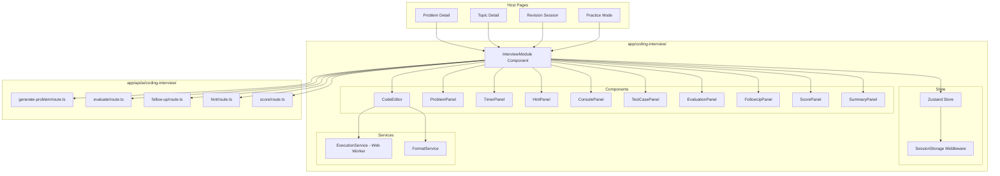
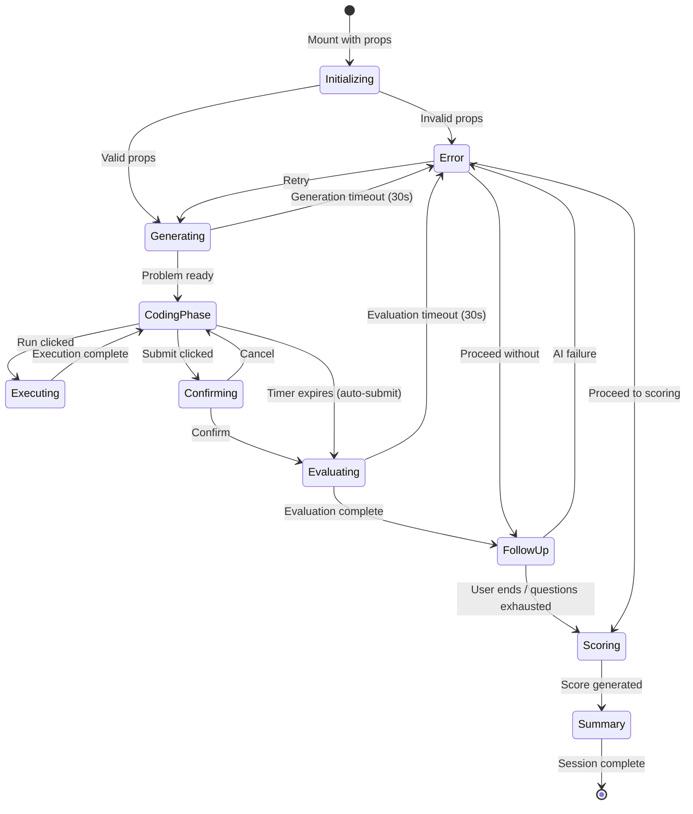

# Design Document: Coding Interview Module

## Overview

The Coding Interview Module is a self-contained, reusable React component that simulates a realistic senior-engineer-led coding interview experience within the existing Knowledge Workspace Next.js application. It can be embedded in any page (Problem Detail, Topic Detail, Revision, Practice, etc.) via configuration props and orchestrates the full interview lifecycle: AI problem generation, timed coding, sandboxed execution, AI evaluation, interactive follow-up, progressive hints, scoring, and session summary.

The module is designed as a feature-scoped directory (`app/coding-interview/`) following the existing project conventions for client components, hooks, and lib modules. It uses Zustand for state management (already a project dependency), CodeMirror for the code editor, and Web Workers for sandboxed code execution. AI services communicate through the existing OpenAI-compatible API pattern (`app/api/ai/`).

## Architecture



### Interview Lifecycle State Machine



## Components and Interfaces

### Directory Structure

```
app/coding-interview/
├── InterviewModule.tsx          # Top-level exported component
├── components/
│   ├── CodeEditor.tsx           # CodeMirror-based editor
│   ├── ProblemPanel.tsx         # Problem description display
│   ├── TimerPanel.tsx           # Countdown/elapsed timer
│   ├── HintPanel.tsx            # Progressive hint UI
│   ├── ConsolePanel.tsx         # Execution output display
│   ├── TestCasePanel.tsx        # Test case results
│   ├── EvaluationPanel.tsx      # AI evaluation feedback
│   ├── FollowUpPanel.tsx        # Interactive follow-up chat
│   ├── ScorePanel.tsx           # Scoring dimensions display
│   ├── SummaryPanel.tsx         # Session summary and recs
│   ├── ConfirmDialog.tsx        # Reusable confirmation modal
│   └── index.ts                 # Barrel export
├── store/
│   ├── interviewStore.ts        # Zustand store definition
│   └── persistence.ts           # sessionStorage middleware
├── services/
│   ├── executionWorker.ts       # Web Worker for sandboxed exec
│   ├── executionService.ts      # Worker communication layer
│   ├── formatService.ts         # Code formatting utility
│   └── deepEqual.ts             # Deep equality comparison
├── lib/
│   ├── types.ts                 # All TypeScript interfaces
│   ├── api.ts                   # API client functions
│   ├── constants.ts             # Config defaults, limits
│   ├── validation.ts            # Props/input validation
│   └── scoring.ts               # Scoring logic (pure functions)
├── hooks/
│   ├── useInterviewSession.ts   # Main orchestration hook
│   ├── useTimer.ts              # Timer logic hook
│   ├── useCodeExecution.ts      # Execution trigger hook
│   └── useFollowUp.ts          # Follow-up conversation hook
└── __tests__/
    ├── validation.test.ts
    ├── scoring.test.ts
    ├── deepEqual.test.ts
    ├── persistence.test.ts
    └── formatService.test.ts
```

### Component Props Interfaces

```typescript
// InterviewModule.tsx - Top-level component
interface InterviewModuleProps {
  source: InterviewSource;
  context?: InterviewContext;
  language?: 'javascript' | 'typescript';
  difficulty?: 'easy' | 'medium' | 'hard';
  duration?: number; // 1-180 minutes
}

type InterviewSource = 'problem' | 'topic' | 'self-test' | 'revision' | 'practice' | 'interview';

type InterviewContext =
  | { source: 'problem'; id: string; title: string; category: string; tags: string[] }
  | { source: 'topic'; id: string; title: string; concepts: string[] }
  | { source: 'revision'; sessionId: string; topicIds: string[] }
  | { source: 'self-test' | 'practice' | 'interview' };
```

### Code Editor Component

```typescript
interface CodeEditorProps {
  value: string;
  onChange: (value: string) => void;
  language: 'javascript' | 'typescript';
  boilerplate: string;
  readOnly?: boolean;
}
```

Uses CodeMirror 6 (`@codemirror/view`, `@codemirror/lang-javascript`, `@codemirror/lang-typescript`) for:
- Syntax highlighting with theme-aware color schemes
- Auto-indentation on Enter after block openers
- Bracket/quote auto-close
- Line numbers
- Configurable via extensions

**Rationale**: CodeMirror 6 is chosen over Monaco because it's lighter weight (~100KB vs ~2MB), tree-shakeable, and better suited for embedding in a larger application. Monaco would add significant bundle size for features we don't need (multi-file editing, intellisense).

### Execution Service (Web Worker)

```typescript
// executionService.ts
interface ExecutionRequest {
  code: string;
  language: 'javascript' | 'typescript';
  testCases: TestCase[];
  timeout: number; // ms, default 5000
}

interface ExecutionResult {
  consoleOutput: string;
  testResults: TestCaseResult[];
  executionTimeMs: number;
  memoryUsageMb: number;
  error?: ExecutionError;
}

interface TestCaseResult {
  input: unknown;
  expectedOutput: unknown;
  actualOutput: unknown;
  passed: boolean;
  executionTimeMs: number;
}

interface ExecutionError {
  type: 'syntax' | 'runtime' | 'timeout';
  message: string;
  line?: number;
  stack?: string;
}
```

The Web Worker approach provides:
- Sandboxed execution (no access to DOM, localStorage, or network)
- Timeout enforcement via `setTimeout` + `worker.terminate()`
- Memory isolation from the main thread
- TypeScript execution via in-worker transpilation (esbuild-wasm or sucrase)

### Timer Hook

```typescript
interface UseTimerReturn {
  elapsedSeconds: number;
  remainingSeconds: number;
  isRunning: boolean;
  isPaused: boolean;
  isWarning: boolean; // remaining <= 300s (5 min)
  isExpired: boolean;
  pause: () => void;
  resume: () => void;
  formatTime: (seconds: number) => string; // MM:SS
}
```

## Data Models

### Problem Model

```typescript
interface GeneratedProblem {
  title: string;
  difficulty: 'easy' | 'medium' | 'hard';
  category: string;
  tags: string[]; // >= 2
  statement: string;
  constraints: string[];
  inputFormat: string;
  outputFormat: string;
  samples: SampleIO[]; // >= 2
  edgeCases: EdgeCase[]; // >= 2
  hiddenTestCases: TestCase[]; // >= 5
  expectedTimeComplexity: string; // Big-O
  expectedSpaceComplexity: string; // Big-O
  companyTags: string[]; // 1-5
  boilerplate: string; // Starter code
}

interface SampleIO {
  input: string;
  output: string;
  explanation: string;
}

interface EdgeCase {
  description: string;
  input: string;
  expectedOutput: string;
}

interface TestCase {
  input: unknown;
  expectedOutput: unknown;
}
```

### Evaluation Model

```typescript
interface EvaluationReport {
  correctness: {
    testsPassed: number;
    testsTotal: number;
    results: TestCaseResult[];
  };
  algorithmChoice: {
    submittedComplexity: string;
    optimalComplexity: string;
    isOptimal: boolean;
    feedback: string;
  };
  complexityAnalysis: {
    timeComplexity: string;
    spaceComplexity: string;
    explanation: string;
  };
  codeQuality: {
    positives: string[];
    improvements: string[];
    score: number;
  };
  edgeCaseHandling: {
    handled: string[];
    missed: string[];
  };
  errorHandling: {
    assessment: string;
    suggestions: string[];
  };
}
```

### Scoring Model

```typescript
interface ScoringReport {
  overallScore: number; // 0-100
  dimensions: {
    communication: DimensionScore;
    codingAbility: DimensionScore;
    problemSolving: DimensionScore;
    algorithmSelection: DimensionScore;
    complexityAnalysis: DimensionScore;
    edgeCaseCoverage: DimensionScore;
    codeQuality: DimensionScore;
  };
  confidence: number; // 0-100%
  readiness: 'not ready' | 'needs practice' | 'almost ready' | 'ready';
  penalties: {
    hintsUsed: number;
    timePenalty: number;
    executionAttempts: number;
  };
}

interface DimensionScore {
  score: number; // 0-100
  justification: string; // 1-3 sentences
}
```

### Session Summary Model

```typescript
interface SessionSummary {
  strengths: string[]; // 1-5
  weaknesses: string[]; // 1-5
  missedEdgeCases: Array<{ case: string; explanation: string }>;
  alternativeSolutions: Array<{
    approach: string;
    timeComplexity: string;
    spaceComplexity: string;
  }>; // 1-3
  studyRecommendations: string[]; // 2-5
  similarProblems: Array<{ title: string; targetSkill: string }>; // 2-5
  nextTopics: string[]; // 1-3
  improvementPlan: Array<{
    action: string;
    priority: 'high' | 'medium' | 'low';
  }>; // 3-7, ordered high→low
}
```

### Zustand Store Shape

```typescript
interface InterviewState {
  // Configuration
  phase: InterviewPhase;
  source: InterviewSource;
  context: InterviewContext | null;
  language: 'javascript' | 'typescript';
  difficulty: 'easy' | 'medium' | 'hard' | null;
  duration: number; // minutes

  // Problem
  problem: GeneratedProblem | null;

  // Editor
  code: string;
  boilerplate: string;

  // Timer
  elapsedSeconds: number;
  timerRunning: boolean;

  // Execution
  lastExecutionResult: ExecutionResult | null;
  executionCount: number;

  // Hints
  hintsUsed: number; // 0-4
  hints: string[]; // accumulated hints
  solutionRevealed: boolean;

  // Submission
  submittedCode: string | null;
  evaluation: EvaluationReport | null;

  // Follow-up
  conversationHistory: ConversationMessage[];
  followUpQuestionsAsked: number;

  // Scoring
  scoringReport: ScoringReport | null;
  sessionSummary: SessionSummary | null;

  // Metadata
  sessionStartTime: number; // timestamp
  lastPersistedAt: number; // timestamp

  // Error
  error: string | null;
}

type InterviewPhase =
  | 'initializing'
  | 'generating'
  | 'coding'
  | 'executing'
  | 'confirming'
  | 'evaluating'
  | 'follow-up'
  | 'scoring'
  | 'summary'
  | 'error';

interface ConversationMessage {
  role: 'interviewer' | 'candidate';
  content: string;
  timestamp: number;
}
```

### Session Persistence

The Zustand store uses a custom `persist` middleware that writes to `sessionStorage`:

```typescript
// persistence.ts
const STORAGE_KEY = 'coding-interview-session';
const MAX_AGE_MS = 24 * 60 * 60 * 1000; // 24 hours

function shouldRestore(persisted: PersistedState): boolean {
  return Date.now() - persisted.lastPersistedAt < MAX_AGE_MS;
}
```

State is serialized on every mutation and restored on mount. Session is cleared when phase reaches `'summary'` or user explicitly ends.

## Correctness Properties

*A property is a characteristic or behavior that should hold true across all valid executions of a system — essentially, a formal statement about what the system should do. Properties serve as the bridge between human-readable specifications and machine-verifiable correctness guarantees.*

### Property 1: Configuration Validation

*For any* source value and context object combination, the Interview Module should accept the configuration if and only if the source is a valid member of the allowed set AND the context (if provided) contains all required fields for that source type. Invalid configurations should produce an error state without initiating the session.

**Validates: Requirements 1.2, 1.8**

### Property 2: Duration Range Validation

*For any* numeric value n provided as the duration prop, the Interview Module should accept it if and only if n is an integer in the range [1, 180]. If no duration is provided, the timer should default to 45 minutes.

**Validates: Requirements 1.5, 9.6**

### Property 3: Auto-Indentation

*For any* code string ending with an opening character from the set `{ ( [ ` or a block-level keyword (`function`, `if`, `else`, `for`, `while`, `switch`, `class`), pressing Enter should produce a new line indented by the configured indentation width (2 spaces) relative to the current line.

**Validates: Requirements 2.2**

### Property 4: Bracket Auto-Close

*For any* opening character from the set `{ ( [ " ' \``, inserting it into the editor should produce the corresponding closing character (`} ) ] " ' \``) and position the cursor between the pair.

**Validates: Requirements 2.3**

### Property 5: Format Idempotence

*For any* syntactically valid JavaScript or TypeScript code, applying the format operation twice should produce the same result as applying it once: `format(format(code)) === format(code)`.

**Validates: Requirements 2.8**

### Property 6: Format Preservation on Error

*For any* code string that contains syntax errors, applying the format operation should preserve the original content unchanged and produce an error indication.

**Validates: Requirements 2.9**

### Property 7: Output Truncation

*For any* execution output string, if its length exceeds 10,000 characters, the displayed output should be exactly 10,000 characters followed by a truncation indicator. If length <= 10,000, the full output should be displayed.

**Validates: Requirements 3.2**

### Property 8: Test Case Deep Equality

*For any* two values (function return value and expected output), a test case should pass if and only if the values are deeply equal — meaning identical structure and values for all nested objects, arrays, and primitives.

**Validates: Requirements 3.6**

### Property 9: Generated Problem Structure Validation

*For any* problem produced by the Problem Generator, it must contain: a non-empty title, a valid difficulty level, a category, at least 2 tags, a problem statement, constraints, I/O format, at least 2 samples with explanations, at least 2 edge cases, at least 5 hidden test cases, valid Big-O time complexity, valid Big-O space complexity, and between 1 and 5 company tags.

**Validates: Requirements 4.1, 4.2, 4.3, 4.6**

### Property 10: Context-Aware Problem Generation

*For any* context prop provided with categories, tags, or concepts, the generated problem's category or tags must overlap with at least one item from the context. When a difficulty prop is also provided, the problem must additionally match that difficulty level exactly.

**Validates: Requirements 4.4, 4.5, 4.9**

### Property 11: Evaluation Report Structure

*For any* evaluation response, it must contain separate non-empty sections for: correctness, algorithm choice, complexity analysis, code quality, edge case handling, and error handling.

**Validates: Requirements 6.7**

### Property 12: Follow-Up Response Length

*For any* user response submitted during the follow-up phase, it should be accepted if its length is at most 2,000 characters. Responses exceeding 2,000 characters should be rejected with an indication.

**Validates: Requirements 7.9**

### Property 13: Hint State Invariants

*For any* hint state with N hints consumed (0 ≤ N ≤ 4): (a) all hints from level 1 to N should be displayed in chronological order; (b) the "Show Solution" control should be visible if and only if N === 4; (c) the hint count reported to the Scoring Engine should equal exactly N.

**Validates: Requirements 8.6, 8.7, 8.8**

### Property 14: Timer Format

*For any* non-negative integer seconds value, `formatTime(seconds)` should produce a string in MM:SS format where MM = `floor(seconds / 60)` zero-padded to 2 digits and SS = `seconds % 60` zero-padded to 2 digits.

**Validates: Requirements 9.2**

### Property 15: Score Readiness Mapping

*For any* overall score s (integer 0-100), the readiness rating should be: "not ready" if 0 ≤ s ≤ 39, "needs practice" if 40 ≤ s ≤ 59, "almost ready" if 60 ≤ s ≤ 79, "ready" if 80 ≤ s ≤ 100.

**Validates: Requirements 10.4**

### Property 16: Scoring Penalty Monotonicity

*For any* two session data sets A and B that are identical except A has more hints used (or more execution attempts) than B, the overall score for A should be less than or equal to the overall score for B.

**Validates: Requirements 10.5**

### Property 17: Score Range Validity

*For any* scoring report, the overall score and all 7 dimension scores must be integers in [0, 100], and the confidence must be in [0, 100].

**Validates: Requirements 10.1, 10.2, 10.3**

### Property 18: Session Summary Structure

*For any* completed session summary: strengths count must be in [1, 5]; weaknesses count in [1, 5]; alternative solutions count in [1, 3] each with approach name, time complexity, and space complexity; study recommendations in [2, 5]; similar problems in [2, 5] each with title and target skill; next topics in [1, 3]; improvement plan items in [3, 7] each with priority label, ordered from highest to lowest priority.

**Validates: Requirements 11.1, 11.2, 11.4, 11.5, 11.6, 11.7, 11.8**

### Property 19: Session Persistence Round-Trip

*For any* valid interview state, serializing to sessionStorage and then deserializing should produce an equivalent state — meaning code content, elapsed seconds, hints consumed, conversation history, and all other fields are identical after the round-trip.

**Validates: Requirements 12.7**

### Property 20: Session Staleness Check

*For any* persisted state with timestamp T, if `Date.now() - T > 24 hours`, the state should be discarded and a fresh session initiated. If `Date.now() - T ≤ 24 hours`, the state should be restored.

**Validates: Requirements 12.9**

## Error Handling

### Error Categories

| Category | Trigger | Recovery |
|----------|---------|----------|
| **Configuration Error** | Invalid props (bad source, missing context fields, out-of-range duration) | Display error, do not start session |
| **Generation Timeout** | Problem generation exceeds 30s | Show error + retry button |
| **Execution Error** | Syntax error, runtime error, or timeout in user code | Display error details in console panel; do not block further attempts |
| **Evaluation Timeout** | AI evaluation exceeds 30s | Show error + retry or proceed to follow-up |
| **Follow-Up Failure** | AI service error during follow-up | Show error + retry or proceed to scoring |
| **Scoring Failure** | Scoring generation fails | Show partial results with error indication |
| **Persistence Error** | sessionStorage quota exceeded or parse failure | Warn user, continue without persistence |

### Error Recovery Strategy

1. **Non-blocking errors** (execution errors, formatting failures): Display inline, allow user to continue working.
2. **Recoverable AI errors** (generation, evaluation, follow-up): Offer retry (up to 3 attempts) or skip to next phase.
3. **Fatal errors** (invalid configuration): Display error state, block session from starting.
4. **Degradation errors** (partial data unavailable): Render available sections, mark missing sections with explanation.

### Error State in Store

```typescript
interface InterviewError {
  type: 'config' | 'generation' | 'execution' | 'evaluation' | 'followup' | 'scoring' | 'persistence';
  message: string;
  retryable: boolean;
  timestamp: number;
}
```

## Testing Strategy

### Property-Based Tests (fast-check)

The module uses `fast-check` as the property-based testing library (well-maintained, TypeScript-native, integrates with Vitest). Each correctness property maps to a single property-based test with a minimum of 100 iterations.

**Tag format**: `Feature: coding-interview-module, Property {N}: {title}`

Property-based tests focus on the pure logic layer:
- `validation.ts` — Props validation (Properties 1, 2)
- `scoring.ts` — Readiness mapping, penalty calculation, score ranges (Properties 15, 16, 17)
- `deepEqual.ts` — Deep equality comparison (Property 8)
- `persistence.ts` — Serialization round-trip, staleness check (Properties 19, 20)
- `formatService.ts` — Format idempotence, error preservation (Properties 5, 6)
- `lib/constants.ts` — Timer format (Property 14)

### Unit Tests (Vitest)

Example-based unit tests for:
- Component rendering in each phase
- Timer lifecycle (start, pause, resume, expire)
- Execution service communication with Web Worker
- Hint panel state progression
- Store actions and state transitions
- API client functions (mocked responses)

### Integration Tests

- Full interview lifecycle from mount to summary
- AI service communication (mocked at API boundary)
- sessionStorage persistence and restoration
- Theme switching propagation to CodeMirror

### Test Configuration

```typescript
// vitest.config.ts additions
{
  test: {
    environment: 'jsdom', // For component tests
    include: ['app/coding-interview/**/*.test.ts'],
  }
}
```

### Dependencies to Add

```json
{
  "dependencies": {
    "@codemirror/view": "^6.x",
    "@codemirror/state": "^6.x",
    "@codemirror/lang-javascript": "^6.x",
    "@codemirror/autocomplete": "^6.x",
    "@codemirror/commands": "^6.x",
    "@codemirror/language": "^6.x"
  },
  "devDependencies": {
    "fast-check": "^3.x"
  }
}
```

**Design Decisions Summary:**

1. **CodeMirror over Monaco**: Smaller bundle (~100KB vs ~2MB), tree-shakeable, sufficient for single-language editing.
2. **Web Worker over iframe**: Simpler communication API, no CSP issues, better TypeScript support, easier timeout enforcement.
3. **Zustand over Context**: Already in the project, supports middleware (persistence), no prop-drilling, efficient re-renders via selectors.
4. **Feature-scoped directory** (`app/coding-interview/`): Follows the existing pattern of `app/revision/` with components, hooks, lib subdirectories.
5. **Separate API routes per AI action**: Each endpoint (`generate-problem`, `evaluate`, `follow-up`, `hint`, `score`) is isolated for independent error handling, timeout configuration, and streaming support.
6. **sessionStorage over localStorage**: Session-scoped by design — interview state is ephemeral and should not persist across browser sessions.
